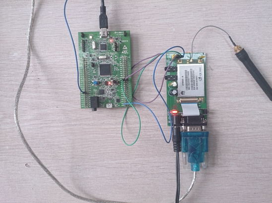
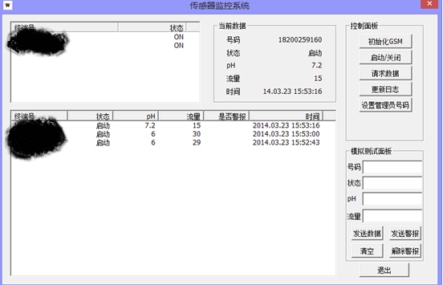

<h2>
<a name="remote_water_quality_monitoring" class="anchor" href="#remote_water_quality_monitoring"></a>remote_water_quality_monitoring</h2>

a lower computer program as a part of a project aimed at monitoring remote water quality...(stm32f4-based, gsm communication)

  

<h2>
<a name="general-description" class="anchor" href="#general-description"></a>1 系统综述（general description）</h2>

<h3>
<a name="system-framework" class="anchor" href="#system-framework"></a>1.1 系统结构（system framework）</h3>

&nbsp;&nbsp;本系统是一个<strong>演示系统</strong>，由控制模块、通信模块、传感器模块、电源模块构成。控制模块采用微处理器作为控制中心，通信模块采用<strong>GSM</strong>模块，传感器模块目前仅用用户接口<strong>模拟</strong>调控水质监测数据，电源模块目前直接使用外部供电电源。

 

<h3>
<a name="system-function" class="anchor" href="#system-function"></a>1.2 系统功能简介（system function）</h3>

&nbsp;&nbsp;本系统是"基于GSM的取水口远程管理与水质警报系统"的<strong>下位机系统</strong>，具有<strong>监测系统安装水域水质，并实时与控制中心交互信息</strong>的功能。具体说来，本系统能监测PH值、流量等各种水质数据，向控制中心发送事务性数据信息，警报信息、警报解除信息及运行状态信息，接受控制中心控制指令。

  

<h2>
<a name="running-environment" class="anchor" href="#running-environment"></a>2 运行环境（running environment）</h2>

<h3>
<a name="physical-environment" class="anchor" href="#physical-environment"></a>2.1 物理环境（physical environment）</h3>

&nbsp;&nbsp;本系统未来将运行于水库、河塘等野外环境。因目前是演示版本，故在节能、抗击打等方面未达到工业标准。

 

<h3>
<a name="hardware" class="anchor" href="#hardware"></a>2.2 硬件设备（hardware）</h3>

&nbsp;&nbsp;采用Cortex-M4内核的32位微处理器<strong>STM32F4</strong>作为下位机系统开发平台，以华为公司的<strong>GTM900</strong>为核心搭建GSM模块。本下位机系统作为一个通用演示平台，目前未挂载任何传感器模块，仅提供模拟数据控制接口，但为方便日后实际投入生产的扩展需要，系统支持传感器模块扩展。

 

<h3>
<a name="software" class="anchor" href="#software"></a>2.2 软件（通信协议）支持（software&protocol）</h3>

&nbsp;&nbsp;采用GSM作为底层通信支持（使用短信作为数据交互媒介），应用层采用自行开发的通信协议作为下位机与控制中心数据交互的行为规范。

&nbsp;&nbsp;下位机系统与控制中心交互如下几类信息：

<ul class="task-list">
	<li>（1）sj（数据）信息机器号、PH值、流量值、水阀状态、当前时间。</li>
	<li>（2）zt（状态）信息，包含机器号、PH值、流量值、水阀状态、当前时间。</li>
	<li>（3）kz (控制) 信息，包含机器号、控制水阀状态、当前时间。</li>
	<li>（4）jb（警报）信息，包含机器号、PH值、水阀状态、当前时间。</li>
	<li>（5）nj（解除警报）信息，包含机器号、PH值、水阀状态、当前时间。</li>
	<li>（6）sjack（数据应答）信息，包含机器号、当前时间。</li>
	<li>（7）ztqry（状态询问）信息，包含机器号、当前时间。</li>
	<li>（8）jback（警报应答）信息，包含机器号、当前时间。</li>	
	<li>（9）njack（警报解除应答）信息，包含机器号、当前时间。</li>
</ul>
  

<h2>
<a name="how-to-use" class="anchor" href="#how-to-use"></a>3 系统操作说明（how to use）</h2>

<h3>
<a name="install-running" class="anchor" href="#install-running"></a>3.1 安装与运行（install&running）</h3>

<h4>
<a name="install" class="anchor" href="#install"></a>3.1.1 安装（install）</h4>

&nbsp;&nbsp;本下位机的配置信息（机器号、控制中心号码台、应用通信协议等）出厂烧写入固件中，系统上电即可运行。烧写过程在IAR编译器环境下完成。

<h4>
<a name="running" class="anchor" href="#running"></a>3.1.2 运行（running）</h4>

&nbsp;&nbsp;本下位机系统开机后，自动依次进行如下初始化操作：

<ul class="task-list">
	<li>（1）加载配置信息，初始化各资源（定时器、GSM模块、传感器初始化等）；</li>
  <li>（2）向控制中心（上位机系统）注册设备信息（实际上是sj信息）；</li>
  <li>（3）等待控制中心的注册回复信息（下位机带超时重发功能，本系统初始化设为60s）。注册回复信息可能是数据应答信息或者状态询问信息，若是状态询问信息，下位机自动回复当前状态。注册完成。</li>
  <li>（4）进入正常工作状态。</li>
</ul>

&nbsp;&nbsp;正常工作状态下，自动执行如下操作：

<ul class="task-list">
	<li>（1）定时向控制中心发送sj型信息；</li>
	<li>（2）检测下位机控制按钮（方便系统演示用）。若触动ph/流量增/减按钮，系统模拟的ph/流量值增/减1个单位，指示灯指示数据变化；触动警报按钮（仅解除警报模式下有效），则紧急关闭水阀，状态指示灯指示非正常工作，并向控制中心发送jb（警报）信息（超时重发时间初始化设为60s）；触动解除警报按钮（仅警报模式下有效），则警报解除，状态指示灯指示正常工作，系统自动向控制中心发送nj（警报解除）信息（超时重发时间初始化设为60s）；</li>
	<li>（3）查询控制中心控制信息。这些控制信息包括sjack（数据应答）信息、ztqry（状态询问）信息、jback（警报应答）信息、njack（警报解除应答）信息、kz（控制）信息。若查询到ztqry信息，则自动向控制中心回复当前zt（状态）信息；若查询到jback信息，则停止jb超时重传计时器；若查询到njack信息，则停止nj超时重传计时器；若查询到kz信息，则自动调整工作状态（水阀开闭，演示系统用状态指示灯指示），自动向控制中心回复当前zt（状态）信息。收到sjack（数据应答）信息不做处理。</li>
</ul>
 

<h3>
<a name="exception-recovery" class="anchor" href="#exception-recovery"></a>3.2 出错处理与恢复（exception&recovery）</h3>
<ul class="task-list">
	<li>（1）系统初始化阶段，GSM模块可能无法正常启动（不能向移动台注册sim卡信息），则系统将始终处于尝试连线状态。</li>
	<li>（2）系统进入正常工作状态后，若检测到GSM模块出现故障（因各种原因导致无法正常收发信息），则自动退出正常工作状态，转而进行GSM模块初始化（但依然认为自己在线）。</li>
</ul>
 

<h3>
<a name="notice" class="anchor" href="#notice"></a>3.3 注意事项（notice）</h3>
<ul class="task-list">
	<li>（1）下位机自身不存储也不在sim卡的短信中心存储短信。读完即删除短信中心短信。</li>
	<li>（2）由于信息存在延时问题，未避免整个系统(上下位机)信息拥塞，下位机信息超时重发次数设有上限（初始化设为3）。</li>
	<li>（3）下位机一旦上线（向控制中心注册），就认为自己始终在线，且不能主动下线，但控制中心一定时间内未得到下位机消息，即将该下位机标识为下线状态。</li>
</ul>
  

<h2>
<a name="presentation" class="anchor" href="#presentation"></a>4 图片展示(presentation)</h2>
<h3>
	
下位机系统（lower computer system）
</h3>
&nbsp;&nbsp;&nbsp;&nbsp;</img>
    

<h3>
	
上位机系统（upper computer system）
</h3>
&nbsp;&nbsp;&nbsp;&nbsp;</img>
    